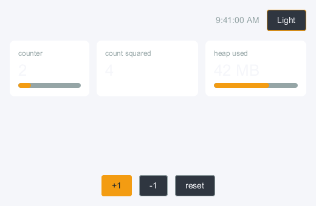
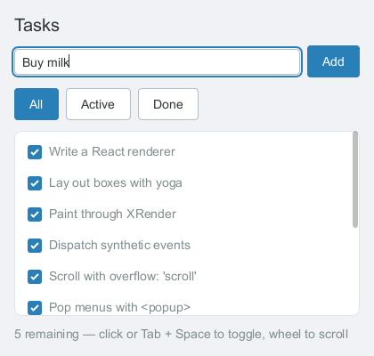
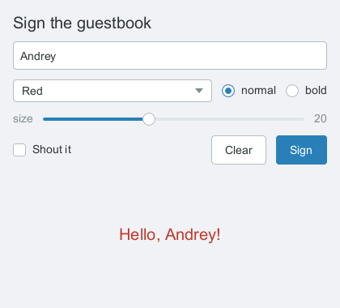
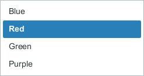
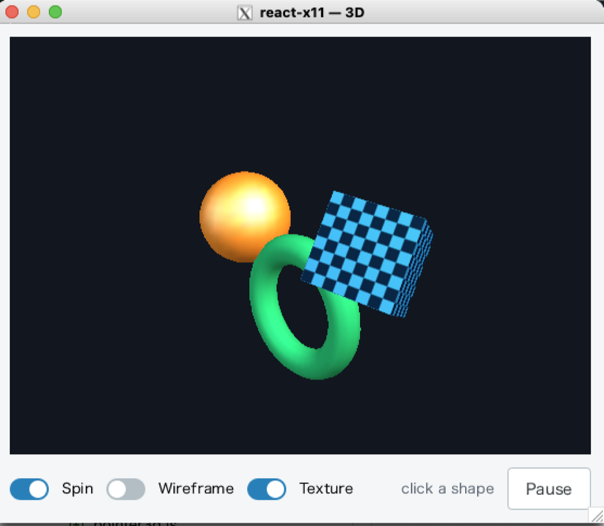

# react-x11

[](https://github.com/sidorares/react-x11/actions/workflows/ci.yml)

React custom rendering where side effects are communication with an [X11
server](https://www.x.org/wiki/Documentation/): react-like ergonomics on top
of [ntk](https://github.com/sidorares/ntk). Build small GUI programs for the
X Window environment (a linux desktop, or macOS +
[XQuartz](https://www.xquartz.org/)) with your React / React Native
experience — flexbox layout, components, hooks, synthetic events.

Everything is JavaScript all the way down: ntk /
[node-x11](https://github.com/sidorares/node-x11) implement the X11 protocol
in pure JS (think xlib rewritten in node.js), layout is
[yoga-layout](https://www.npmjs.com/package/yoga-layout), text shaping is
[fontkit](https://github.com/foliojs/fontkit). `npm install` never compiles
anything — and `npm test` doesn't even need an X server (node-x11 ships an
in-process pure-JS X server that the tests render into and read pixels back
from; every screenshot below was rendered that way too, by driving the real
examples through the real event pipeline).

| `examples/dashboard.jsx` — context theming, hooks | `examples/tasks.jsx` — useReducer, textinput, scrollview |
| ------------------------------------------------- | -------------------------------------------------------- |
|               |                              |

| `examples/form.jsx` — textinput + Select | the open Select menu (a real `<popup>` window) |
| ---------------------------------------- | ---------------------------------------------- |
|                |        |

`examples/three.jsx` — a react-three-fiber-shaped scene over **indirect
GLX**: `<mesh>`, geometries, materials, lights and a texture, drawn by
sending the GL protocol over the X connection. No native bindings, no GPU
driver bindings — the same "JavaScript all the way down" story as the rest.



## Quick start

```sh
npm install react-x11 react
```

```jsx
import React, { useState } from 'react';
import { createRoot } from 'react-x11';

function Counter() {
  const [n, setN] = useState(0);
  return (
    <window
      width={240}
      height={120}
      title="counter"
      style={{ backgroundColor: '#f4f4f4' }}
    >
      <box
        style={{
          flexGrow: 1,
          alignItems: 'center',
          justifyContent: 'center',
          gap: 10,
        }}
      >
        <text style={{ fontSize: 24 }}>{String(n)}</text>
        <box
          style={{
            backgroundColor: '#2980b9',
            borderRadius: 6,
            padding: 8,
            cursor: 'pointer',
            ':hover': { backgroundColor: '#1f6693' },
          }}
          onClick={() => setN(n + 1)}
        >
          <text style={{ color: 'white' }}>+1</text>
        </box>
      </box>
    </window>
  );
}

const root = await createRoot(); // connects via $DISPLAY
root.render(<Counter />);
```

Run it with `tsx` or any JSX-capable loader — or skip JSX entirely with
`React.createElement` (see
[`examples/simple-nojsx.js`](examples/simple-nojsx.js), plain node, no build
step).

## Elements

Only `<window>`, `<popup>` and `<glarea>` map to real X11 windows.
Everything else is laid out by yoga and drawn client-side into the window's
double-buffered 2d context — see [NEXT_STEPS.md](NEXT_STEPS.md) for the architecture rationale
and [docs/](docs/README.md) for the full API reference.

| element        | what it is                                                                                                           |
| -------------- | -------------------------------------------------------------------------------------------------------------------- |
| `<window>`     | a real X11 window; the flex, paint and event root                                                                    |
| `<popup>`      | an override-redirect window at screen coordinates — menus, tooltips, dropdowns                                       |
| `<box>`        | flex container: layout props → yoga, plus backgrounds, borders (solid/dashed, radius), overflow clipping, zIndex     |
| `<scrollview>` | clipped, wheel-scrollable viewport with a drawn scrollbar                                                            |
| `<text>`       | shaped, wrapped text (bidi, ligatures, font fallback); nested `<text>` elements are style spans                      |
| `<textinput>`  | single-line editor: caret/selection via ntk's TextLayout caret API, clipboard (CLIPBOARD + X11 PRIMARY), word select |
| `<image>`      | PNG/JPEG from `src`, natural-size aware                                                                              |
| `<canvas>`     | escape hatch: `onDraw={(ctx, {width, height}) => …}` with ntk's canvas-like 2d context (XRender-backed)              |
| `<markdown>`   | ntk MarkdownView: headings, tables, highlighted fences, math, mermaid; `onLink`                                      |
| `<html>`       | ntk HtmlView: CSS cascade, block/flex layout, images; `onLink`                                                       |
| `<svg>`        | static SVG through ntk SvgView, sized like `<image>`                                                                 |
| `<tex>`        | a KaTeX formula (ntk `layoutTex`), intrinsically sized                                                               |
| `<glarea>`     | an OpenGL surface over indirect GLX; the 3D scene below lives inside it                                              |

Widget **components** (plain React on top of the primitives, themable via
`ThemeProvider`): `Button`, `Checkbox`, `Radio`/`RadioGroup`, `Switch`,
`Slider`, `ProgressBar`, `Select`, `Tooltip`, `MenuBar`/`ContextMenu`,
`Dialog` — a modal built on `<popup trapFocus>`, which traps Tab and
restores focus when it closes — plus the two containers an application
window is built from: `Tabs` and `SplitPane`. See
[docs/components.md](docs/components.md).

### 3D

Inside a `<glarea>` (or the `Canvas3D` component) the children are scene
elements with react-three-fiber's names:

```jsx
<Canvas3D style={{ flexGrow: 1 }} camera={{ position: [0, 2, 6], fov: 45 }}>
  <ambientLight intensity={0.35} />
  <pointLight position={[5, 6, 6]} />
  <mesh rotation={[0.5, 0.4, 0]} onClick={() => pick()}>
    <boxGeometry args={[1.4, 1.4, 1.4]} />
    <meshPhongMaterial color="#2980b9" shininess={60} />
  </mesh>
</Canvas3D>
```

`<mesh>`, `<group>`, box/plane/sphere/cylinder/torus geometries,
`<bufferGeometry>`, basic/Lambert/Phong materials with textures, four light
types, and pointer events resolved by client-side raycasting. Each geometry
is compiled into a **server-side display list** once, so a frame costs
matrices plus one `CallList` per mesh whatever the triangle count. What the
protocol cannot do — shaders, instancing, post-processing, shadows — throws
with the reason rather than half-working. See
[docs/elements.md](docs/elements.md#3d-scene-mesh-group-geometries-materials)
and [docs/glx-plan.md](docs/glx-plan.md).

Events are synthetic with capture/bubble phases and hit testing over the
drawn tree: `onClick` (with DOM-style `detail` click counting),
`onMouseDown/Up/Move`, `onMouseEnter/Leave`, `onWheel`, `onKeyDown/Up`,
`focusable` + `onFocus`/`onBlur` + Tab traversal, and a `cursor` prop.
User handlers run before element default actions and can
`ev.preventDefault()` — stopping a `<textinput>` from editing or a
`<scrollview>` from scrolling, like the DOM.

## Examples

All need an X server (`DISPLAY` set; XQuartz on macOS, Xvfb for automation):

```sh
npm run examples:simple        # hello world (JSX via tsx)
npm run examples:app           # the showcase: Tabs + SplitPane hosting the rest
npm run examples:simple-nojsx  # the same, plain node — no build step
npm run examples:xeyes         # canvas drawing + hooks
npm run examples:dashboard     # context theming, custom hooks, components
npm run examples:tasks         # useReducer, textinput, scrollview
npm run examples:menu          # right-click context menu via <popup>
npm run examples:form          # <textinput> + Select dropdowns
npm run examples:gl            # raw GL in a <glarea> (display-list cube)
npm run examples:three         # <Canvas3D> scene: meshes, lights, textures
```

The two GL examples additionally need a server with **indirect GLX**
enabled (`+iglx` / `AllowIndirectGLX` — off by default on many).

### Hot reloading

```sh
npm run examples:tasks:hot     # then edit examples/tasks.jsx while it runs
```

Runs the tasks example under
[hot-module-replacement](https://github.com/sidorares/hot-module-replacement)'s
ESM hooks (Node ≥ 22.15) with React **Fast Refresh**: saving
`examples/tasks.jsx` updates the edited components in place. The X11
connection, the mounted window, and component state — the task list, even
half-typed text in the input — survive the reload (a component whose hook
signature changed remounts alone). `examples/hmr-register.mjs` wires up the
transform half (babel JSX + react-refresh, chained under the HMR hooks),
`examples/hmr-refresh.js` the runtime half, and `examples/tasks-hot.jsx` is
the hot entry — the pattern works for any example split the same way.

## React DevTools

```sh
npx react-devtools                                # 1. start the standalone UI
REACT_X11_DEVTOOLS=1 npm run examples:dashboard   # 2. run any example with the bridge on
```

The component tree, props and hook state show up live in the DevTools
window; selecting a component inspects it, and hovering an element in the
tree tints its rect in the X11 window (highlight-on-hover).
`REACT_X11_DEVTOOLS_HOST` / `REACT_X11_DEVTOOLS_PORT` override the default
`localhost:8097`. See [docs/devtools.md](docs/devtools.md).

Two more debugging aids:

- `REACT_X11_DEBUG_LAYOUT=1` outlines every laid-out node (color = tree
  depth) — handy when a flexbox doesn't do what you expect.
- refs give you the retained node (`abs` rect, `scrollTo`, …) for drawn
  elements, or the live [ntk](https://github.com/sidorares/ntk) window for
  `<window>`/`<popup>` — the whole ntk API is a ref away.

## Click to component

```sh
REACT_X11_EDITOR=code npm run examples:tasks
```

Alt+Click any rendered element (Option+Click on macOS/XQuartz) to open the
JSX line that created it in your editor. `REACT_X11_EDITOR` picks the CLI
and enables the feature in one go; `REACT_X11_CLICK_TO_COMPONENT=1` does
the same with the default editor
(`cursor`). See [docs/click-to-component.md](docs/click-to-component.md).

## Developing

```sh
npm test             # hermetic: mock smoke tests + in-process X server pixels
npm run lint         # ESLint
npm run format       # Prettier
npm run screenshots  # regenerate docs/img/*.png headlessly (no X server)
```

`docs/img/three.png` is the exception: the headless path has no GL, so the
3D shot is captured by hand from `npm run examples:three` on a real server
with indirect GLX.

See [AGENTS.md](AGENTS.md) for architecture notes and contributor/agent
guidance, [docs/](docs/README.md) for API documentation, and
[NEXT_STEPS.md](NEXT_STEPS.md) for the roadmap.

# See also

https://github.com/chentsulin/awesome-react-renderer
