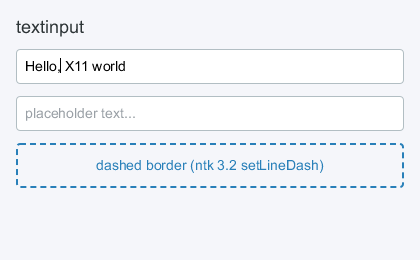
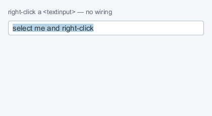

# Elements

Only `<window>`, `<popup>` and `<glarea>` are backed by real X11 windows,
created top-down in React's commit phase so every `CreateWindow` names its
actual parent. Everything else is a retained lightweight node — one
[yoga-layout](https://www.yogalayout.dev/) node each — painted into the
owning window's double-buffered 2d context on ntk's frame clock.

## `style` and props

Everything CSS has a concept for goes in **`style`**; everything else is a
prop. No name means both, which is why `<window width>` is unambiguously the
real window's geometry. See [styling.md](styling.md) for arrays, state
blocks and `createStyles`.

```jsx
<box style={{ flexDirection: 'row', gap: 8 }} onClick={pick}>
  <text style={{ fontSize: 14, color: '#2d3436' }}>hello</text>
</box>
```

## Layout properties (all drawn elements + windows)

Numbers are pixels, strings like `'50%'` / `'auto'` pass through to yoga.

- **Size**: `width`, `height`, `minWidth`, `minHeight`, `maxWidth`,
  `maxHeight`, `aspectRatio`. `<image>` and `<svg>` keep their aspect ratio
  when only one of `width`/`height` is given
- **Flex**: `flexDirection` (`row`, `column`, `row-reverse`,
  `column-reverse`), `justifyContent` (`flex-start`, `center`, `flex-end`,
  `space-between`, `space-around`, `space-evenly`), `alignItems`,
  `alignSelf`, `alignContent`, `flexWrap`, `flexGrow`, `flexShrink`,
  `flexBasis`, `gap`, `rowGap`, `columnGap`
- **Position**: `position` (`relative`, `absolute`, `static`), `top`,
  `right`, `bottom`, `left`
- **Spacing**: `margin`, `marginTop/Right/Bottom/Left`, `padding`,
  `paddingTop/Right/Bottom/Left`
- **Visibility**: `display` (`flex`, `none`), `overflow` (`visible`,
  `hidden`, `scroll`)

**yoga defaults `flexShrink` to 0, where CSS defaults it to 1.** An item
whose base size comes from its content therefore refuses to shrink, and
content wider than the space available pushes the row past its container
instead of being squeezed into it. Write `flex: 1` in full —
`{ flexGrow: 1, flexBasis: 0, minWidth: 0 }` — for anything that should take
the space that is left rather than the space its content wants.
A box with `overflow: 'scroll'` applies exactly that to itself by default.

## Paint properties

- `backgroundColor` — any CSS color string (`'#2980b9'`,
  `'rgba(0,0,0,.5)'`, `'red'`)
- `borderWidth`, `borderColor`, `borderRadius`, `borderStyle`
  (`'solid'` default, `'dashed'`)
- per-side borders: `borderTopWidth`/`Right`/`Bottom`/`Left` override
  `borderWidth` the way `paddingLeft` overrides `padding`, and
  `borderTopColor`/… fall back to `borderColor`. A blockquote's bar is
  `borderLeftWidth: 3` on the quote box, not a 3px sibling; a table rule is
  `borderBottomWidth: 1` on the row. `borderRadius` requires uniform
  borders — a non-uniform border paints square
  ([styling.md](styling.md#per-side-borders))
- `zIndex` — paint/hit order among siblings (stable sort)
- `outlineWidth`, `outlineColor`, `outlineOffset` — the focus ring, painted
  outside the border box and invisible to yoga, so it never moves what it
  surrounds. A focusable node draws one on `:focus-visible` without being
  asked; `outlineWidth: 0` opts out
  ([styling.md](styling.md#the-focus-ring))
- `transition` — `120`, or `{ backgroundColor: 120, left: 200 }`: how long a
  change to that property takes ([styling.md](styling.md#transitions))
- any value may be a **theme token**: `'$panel'` resolves against the nearest
  `theme` prop above the node ([styling.md](styling.md#theme-tokens))
- `'@width >= 600'` blocks restyle for the window's size, layout included
  ([styling.md](styling.md#window-size-queries))
- `opacity` is not implemented yet (see NEXT_STEPS.md)

`cursor` (`'pointer'`, `'text'`, `'wait'`, `'move'`, `'crosshair'`, resize
arrows, … — the ntk cursor name map) and `pointerEvents: 'none'` are style
too: CSS has both, and React Native has been moving `pointerEvents` the same
way. So is `hitSlop`:

```jsx
<box style={{ height: 16, hitSlop: { top: 4, bottom: 4 } }} /> // 24px target
```

`hitSlop: 4` grows every side, the object form only the sides it names. It
is **hit testing and nothing else** — not paint, not yoga — which is what
lets a 16px control answer over the 24px WCAG 2.2 SC 2.5.8 wants without a
taller control misaligning the row it sits in. The slop may overlap a
sibling's box; hit testing runs front to back over paint order, so the
sibling on top keeps its own pixels either way.

## Interaction props

`focusable`, `tabIndex` (sequential focus order; `-1` is focusable but not
tabbable), `autoFocus`, `trapFocus` (own a focus scope — Tab and presses
stay inside it, focus is restored when it unmounts), `disabled` (never
focusable, and the trigger for a `:disabled` style block), and the event
handlers listed in [events.md](events.md).

Every element also takes `role` and the `aria-*` props — the web's
accessibility vocabulary, read by the built-in AT-SPI bridge so screen
readers see the tree. They are inert where no assistive technology is
listening, and the defaults already say something sensible for every
element: [accessibility.md](accessibility.md).

Drag and drop is two more prop families on the same elements —
`dropAccept` + `onDrop` to accept a drop, `draggable` + `dragData` to start
a drag — and works with other X11 applications as well as inside the app.
Their presence is what registers the node, so there is nothing else to
mount: [drag-and-drop.md](drag-and-drop.md).

---

## `<window>`

A real X11 window; the flex, paint and event root for its subtree.

| prop                        |                                                                                                                                               |
| --------------------------- | --------------------------------------------------------------------------------------------------------------------------------------------- |
| `title`                     | window title (UTF-8, via `WM_NAME` + `_NET_WM_NAME`)                                                                                          |
| `width`, `height`, `x`, `y` | window geometry (window state, not yoga style — the user may resize). A size is pixels or `'auto'`, and leaving it out means `'auto'` (below) |
| `backgroundColor`           | full-window clear color (default white)                                                                                                       |
| `onResize(ev)`              | ConfigureNotify — the tree reflows automatically. Fires for **moves** too (see below)                                                         |
| `onExpose(ev)`              | after a repaint was required                                                                                                                  |
| `onCloseRequest(ev)`        | WM close button (opts into `WM_DELETE_WINDOW`)                                                                                                |
| `states`                    | EWMH `_NET_WM_STATE` — controlled, see below                                                                                                  |
| `fullscreen`, `alwaysOnTop` | boolean sugar for two of those states                                                                                                         |
| `decorations`               | `false` asks the WM for no titlebar or border                                                                                                 |
| `transparent`               | 32-bit ARGB visual — rounded, translucent windows (below)                                                                                     |
| `transientFor`              | ICCCM `WM_TRANSIENT_FOR` — the window this one belongs to (below)                                                                             |
| `onStatesChange(states)`    | what the window manager actually did                                                                                                          |
| `theme`                     | palette that `$token` style values resolve against, for this subtree                                                                          |

Windows may be nested inside other windows (real X11 child windows).
**Ref**: the live ntk `Window` — `getContext('2d')`,
`requestAnimationFrame`, `setCursor`, the whole ntk API.

### Natural size

A window with no `width`/`height` is **sized from its content and capped at
the screen**. `'auto'` says the same thing out loud, and the two axes are
independent:

```jsx
<window title="prefs" />                               {/* natural, both ways */}
<window width={600} height="auto" />                   {/* height follows the content */}
<window width="auto" maxWidth={720} minHeight={200} /> {/* auto within your own bounds */}
```

This is CSS's `width: auto`, read the way CSS reads it for a box whose
containing block is the viewport but which is not in flow — a float, an
abspos, an inline-block: **shrink-to-fit**. A top-level window has no
container to stretch into, and stretching into the screen is what
`fullscreen` means.

The size is worked out **before `CreateWindow`**, so the window is created
the right size rather than resized into it after mapping. Nothing is ever on
screen at the wrong size, and there is no jump to watch for.

**How it is measured**, which is worth knowing because the second step is
where the surprises are:

1. The tree is laid out with no available width, so nothing wraps and the
   root reports its **max-content** width.
2. That is clamped into `[minWidth, min(maxWidth, the screen)]` — the same
   size-hint props the window manager enforces also bound the auto size,
   exactly as `min-width`/`max-width` bound `width: auto` in CSS. Where the
   two disagree, `minWidth` wins, which is CSS's order too.
3. The tree is laid out **again at that width**, and the height comes from
   there. A paragraph that had to wrap is taller than step 1 said.

Where this parts company with CSS: shrink-to-fit is
`min(max(min-content, available), max-content)`, and that `max(…)` means a
CSS box never shrinks below its min-content size even when it overflows. A
window cannot be wider than the screen, so the cap wins and the content is
cut instead.

**The cap** is the usable area of the monitor the window will open on:
Xinerama's per-monitor rects — so a window on a two-head desktop is bounded
by one screen and not by both — with `_NET_WORKAREA` taken off it per axis,
so a panel is not space to grow into. Both are read once while `createRoot()`
connects. On a server with neither, the cap is the screen; with no display to
ask at all — the headless mock — there is no cap. The window manager's frame
is _not_ modelled, so a window that reaches the cap is a titlebar taller than
the work area and the WM will trim it.

**Afterwards, auto keeps up with the content until something else sets the
size.** Add a row and the window grows; the moment the user drags an edge, or
a window manager answers with a size of its own, the window is theirs and
stops re-fitting. Setting `width` to a number is the app doing the same
thing, and setting it back to `'auto'` hands it back.

### A floor the content decides

`minWidth`/`minHeight` also take `'auto'`: **the smallest size the content
can be drawn at**, measured from the tree and handed to the window manager,
which is what stops the user dragging the window below it.

```jsx
<window minWidth="auto" minHeight="auto">   {/* never smaller than my content */}
<window width={900} minWidth="auto" />      {/* my opening size, the content's floor */}
```

This is what Qt and GTK both do, and in both it is the default rather than
something you ask for: a Qt layout's `minimumSize()` becomes the window's
via `QLayout::SetDefaultConstraint`, and GTK writes the widget tree's
minimum into the WM geometry hints. Here it is opt-in, because a renderer
whose layout is CSS has no floor unless one is asked for — CSS lets content
overflow.

**How the floor is measured**: the tree is laid out with _no room at all_,
and the floor is how far it still reached. What each node contributes is
whatever its own style lets it shrink to, which makes the interesting part
what _doesn't_ count:

| the node                                               | contributes       |
| ------------------------------------------------------ | ----------------- |
| a rigid box (`flexShrink` is 0 by default — see above) | its whole size    |
| a wrapping row                                         | its widest item   |
| text                                                   | its longest word  |
| `overflow: 'scroll'` / `'hidden'`                      | nothing           |
| `flexShrink: 1`, or a `minWidth: 0` of its own         | what it shrank to |

The last two rows are the escape hatch, and they are the same one CSS,
Qt and GTK all spell — `min-width: 0`, `QScrollArea`, `min-content-width`.
A node that was told it may shrink is taken at its word and its contents
stop counting, so a window around a scrolling pane is floored by everything
_except_ that pane. Naming a number (`minWidth: 240` on the box) is an
answer too, and stops the measurement there.

`maxWidth`/`maxHeight` take `'auto'` as well, and it means the other half of
the pair: **the size the content wanted** — the natural size above, not the
floor. `'auto'` reads as "ask the content", and the content's answer to _how
big_ is not its answer to _how small_. On a tree where nothing can shrink
the two are the same number, which is what makes `minWidth="auto"
maxWidth="auto"` the fixed-size dialog — the same thing `resizable={false}`
says more briefly.

Three things worth knowing:

- **A floor is a request.** mutter, kwin and xfwm enforce it at the drag; a
  tiling window manager may size the window however it likes. It stops the
  user, it does not relieve the app of clipping gracefully — and the
  renderer will not fight a window manager that ignores it.
- **`minHeight="auto"` is measured for the width the window has**, and
  re-sent as that changes. A minimum height is a height _for a width_ — a
  paragraph is tallest at its narrowest — and `WM_NORMAL_HINTS` holds two
  independent numbers with no way to say so. (GTK answers the same question
  at its minimum _width_, which is a taller floor than a wide window needs.)
- **The floor outlives the size.** An `'auto'` size stops tracking once the
  user takes the window over; an `'auto'` bound does not, because stopping
  them going too far is the whole job. It is measured on every frame that
  lays out — one extra layout pass per axis asked for — and written only on
  the frames it actually moves.

Three things worth knowing before reaching for it:

- A scroll container reports its **content** height, not a viewport height,
  so an auto window around a long list opens as tall as the screen. Give the
  window a `height`, or the scrolling box a `maxHeight`, if the scrolling is
  meant to happen inside a smaller window.
- With no available width nothing wraps (and yoga defaults `flexShrink` to
  0 — see [styling.md](styling.md)), so an auto width is the **unwrapped**
  row. That makes the width font-dependent: the same window is wider under a
  wide UI face than under a narrow one.
- Measuring costs an extra layout pass per frame that lays out, for as long
  as the window is still tracking. A window with both sizes given pays
  nothing.

### `onResize` fires for moves

`onResize` is X's `ConfigureNotify`, which reports _any_ geometry change:
under a window manager that moves windows opaquely, dragging one by its
title bar delivers one per pointer step, all the same size. The renderer
already discriminates — a move costs no layout and no repaint — but a
handler of your own has to, or it does its work per step of a drag. The
event says which it was:

```jsx
<window
  onResize={(ev) => {
    if (ev.resized) refit(ev.width, ev.height);
    if (ev.moved) rememberPosition(ev.x, ev.y);
  }}
/>
```

`ev.previous` carries the geometry these are measured against. Note that
`ev.x`/`ev.y` are frame-relative once a reparenting window manager has
framed the window, so they are not screen coordinates — the renderer
resolves the real origin itself for popup anchoring.

### Stacking

Nested `<window>`s stack the way drawn siblings paint: the later sibling
sits on top, and `zIndex` wins over document order. Reordering them in JSX
restacks the real windows — one `ConfigureWindow` pass per commit, and
nothing at all when mount order already agrees.

```jsx
<window>
  <window key="back" /> {/* bottom */}
  <window key="front" /> {/* on top */}
  <window key="always" zIndex={1} /> {/* above both, wherever it sits here */}
</window>
```

Top-level windows are the window manager's to stack — it redirects the
request — so their order in the tree carries no stacking meaning. Use
`alwaysOnTop` (below) for those.

### Window manager hints

Properties the window manager reads (ntk ≥ 3.5.0). All work at mount and
update; unchanged values are not re-sent. The size hints are flat props like
the geometry they constrain — with style in its own channel the yoga names
are free, so no `sizeHints` object is needed.

| prop          |                                                                                                                                           |
| ------------- | ----------------------------------------------------------------------------------------------------------------------------------------- |
| `resizable`   | `false` pins min and max size to the current size                                                                                         |
| size hints    | `minWidth`, `minHeight`, `maxWidth`, `maxHeight`, `widthInc`, `heightInc`, `baseWidth`, `baseHeight`, `minAspect`, `maxAspect`, `gravity` |
| `wmClass`     | `'instance'`, `['instance', 'Class']` or `{instance, class}`                                                                              |
| `windowType`  | `'dialog'`, `'utility'`, `'tooltip'`… or an array of fallbacks                                                                            |
| `decorations` | `false` asks for no titlebar or border                                                                                                    |

```jsx
<window width={400} height={300} resizable={false} windowType="dialog" />
<window width={400} height={300} minWidth={320} minHeight={200} />
<window width={400} height={300} minWidth="auto" /> {/* measured — see above */}
```

The four bounds also take `'auto'`, which asks the content instead of naming
a number: [a floor the content decides](#a-floor-the-content-decides).

On a `<window>` these names are the window's, not yoga's: `width`/`height`
are the real geometry the user can drag, and `minWidth`/`maxHeight` are what
the WM enforces. A window's _contents_ are laid out by its `style`. The size
hints do double duty on an auto-sized window, where they also bound the
natural size (above) — so `resizable={false}` pins the window at whatever its
content measured, which is the fixed-size dialog:

```jsx
<window resizable={false} windowType="dialog" />
```

### `transientFor` — a window that belongs to another

Without it, every secondary top-level window an app opens is, to the window
manager, an unrelated second application: its own taskbar and alt-tab entry,
placed wherever new windows go, stacked independently, and it does not
minimise with the window it belongs to.

```jsx
const main = useRef(null);

<window ref={main} title="editor">…</window>
<window transientFor={main} windowType="dialog" title="Preferences">…</window>
```

Takes a ref to a `<window>`/`<popup>`, a ref to **any drawn node** (resolved
to the window that owns it — so an out-of-flow `<box>` inside the owner is a
perfectly good handle), a raw XID, `'root'` for "transient for this client's
whole window group", or `null` to clear.

Measured against quartz-wm — the thinnest EWMH implementation in the stack,
so this is a floor rather than a best case:

| the client sets       | the WM allows                                                 | the WM adds to `_NET_WM_STATE` |
| --------------------- | ------------------------------------------------------------- | ------------------------------ |
| nothing               | close, minimize, move, resize, maximize horz/vert, fullscreen | —                              |
| `transientFor`        | close, minimize, move, resize                                 | skip_taskbar, skip_pager       |
| `windowType="dialog"` | close, minimize, move, resize                                 | skip_taskbar, skip_pager       |

Rows two and three matching is the EWMH rule working as specified: a managed
window with `WM_TRANSIENT_FOR` and no `_NET_WM_WINDOW_TYPE` **is** a dialog.
The converse does not hold — a `dialog` type with no owner is a dialog
belonging to nobody, with nothing to stack above or iconify with — so set
both, which is what real toolkits do. A fuller window manager also restacks
the transient above its owner and iconifies it alongside; quartz-wm does
neither, and both are policy rather than spec.

**It is inert on an override-redirect window**, which is every `<popup>` by
default: the WM never manages those, so nothing reads the property. ICCCM
4.1.2.6 draws exactly that distinction — `WM_TRANSIENT_FOR` for windows the
WM manages, override-redirect plus a pointer grab for menus. ntk warns if
you ask it to write the property on one.

Resolution happens in the **commit phase**, not at element creation: a React
ref is not something ntk should be asked to understand. Refs attach in the
layout phase, after every mutation, so on the commit that mounts two sibling
`<window>`s the second realizes while the first one's ref is still null —
that owner is retried on the frame the mount schedules rather than dropped.

`windowIdOf(refOrInstance)` is the same resolution, exported: it returns the
XID a ref points at, or null. It is also what an xdg-desktop-portal
`parent_window` handle needs — `` `x11:${id.toString(16)}` ``, lowercase hex
with **no** `0x` prefix. Both shipping portal backends happen to tolerate a
prefix, which is exactly why it is easy to get wrong and never notice; Qt's
parser returns 0 on failure with no error path, so the symptom would be a
silently unparented, non-modal dialog. `useWindowId(ref)` is the hook form
and returns a getter, like `useAnchor`.

`decorations={false}` writes `_MOTIF_WM_HINTS` — honoured by Mutter, KWin,
Xfwm, Openbox and i3. A window manager that ignores it simply decorates the
window; there is no way to force the matter.

### Window state

`states` is EWMH `_NET_WM_STATE`: `modal`, `sticky`, `maximized` (or
`maximized_vert`/`maximized_horz` individually), `shaded`, `skip_taskbar`,
`skip_pager`, `hidden`, `fullscreen`, `above`, `below`, `demands_attention`,
`focused`. `fullscreen` and `alwaysOnTop` are boolean sugar for the two
everyone reaches for — `fullscreen` and `above` — and they union with
`states` rather than competing with it.

```jsx
<window
  states={['skip_taskbar']}
  fullscreen={isFullscreen}
  onStatesChange={(states) => setFullscreen(states.includes('fullscreen'))}
/>
```

**These are controlled props, and the reason is not React convention.** On X
the window manager changes state behind the app's back constantly: the user
hits maximize, a global hotkey leaves fullscreen, a tiling WM has its own
opinion. react-x11 therefore diffs `states` against the _previous props_,
never against what the window currently has — so a prop is re-sent only when
the app changes its mind, and a WM that disagreed is not fought on the next
commit. `onStatesChange` is the other half: it reports what the WM actually
did, and subscribing to it is what makes react-x11 watch the property, so a
window without a handler costs nothing.

States are applied **before the window is mapped**, which is what EWMH 7.7
requires and the only way to open already fullscreen instead of flashing at
the normal size first.

`alwaysOnTop` falls back to Apple-WM window levels on XQuartz, where
quartz-wm does not support `_NET_WM_STATE_ABOVE`.

### Kiosk

There is no `kiosk` prop, because it is not one thing — it is a window with
no decoration, no taskbar entry, nothing above it, and no pointer:

```jsx
<window
  fullscreen
  decorations={false}
  states={['above', 'skip_taskbar', 'skip_pager']}
  style={{ cursor: 'none', flexGrow: 1 }}
/>
```

`cursor: 'none'` hides the pointer outright (ntk ≥ 4.2.0). It is not the
same as leaving `cursor` unset, which inherits whatever the root window's
cursor is — see [styling.md](styling.md).

### `transparent` — rounded corners and translucency

`transparent` creates the window on a 32-bit ARGB visual, so it has a real
alpha channel: what the tree does not paint stays empty, and a compositor
blends it against whatever is behind. That is what makes rounded corners
possible, and it is the main reason to reach for it:

```jsx
<popup
  transparent
  grab
  style={{ backgroundColor: 'rgba(24, 24, 30, 0.86)', borderRadius: 14 }}
>
  …
</popup>
```

Two props do the work together. `transparent` gives the window somewhere to
put transparency; `borderRadius` in the window's own `style` rounds the
background painted into it, and the corners it gives up are the corners the
desktop then shows through. The edge is **antialiased**, because it is alpha
rather than the Shape extension's 1-bit mask — no `XShapeCombineMask`, no
jagged diagonal.

`backgroundColor` may be translucent, and leaving it unset gives a window
that is empty except for what the tree paints.

`borderRadius` on a window is meaningful **only** with `transparent`. On an
opaque window it is ignored: giving up the corners there would only expose
the server's white, which is worse than square.

### When transparency is not available

Transparency needs two things, and either can be missing: a **depth-32
TrueColor visual** (XQuartz has none), and a **running compositor** (Mutter,
KWin, picom, …) to blend the alpha channel. Without a compositor the X
server shows the raw pixels, and a corner you painted away is not
transparent — it is **black**.

react-x11 never lets that happen. When transparency would not actually be
seen, the window is filled edge to edge and `borderRadius` on it is ignored:
you get the square opaque popup, not a black-cornered one. A translucent
`backgroundColor` is flattened rather than composited onto the last frame.
Nothing is required of the application for that floor to hold.

What the application _does_ control is the design on the other side of it,
through the `'@supports transparency'` style block:

```jsx
<popup
  transparent
  style={{
    backgroundColor: '#1c1c22', // square and opaque, works everywhere
    '@supports transparency': {
      backgroundColor: 'rgba(24, 24, 30, 0.86)',
      borderRadius: 14,
    },
  }}
/>
```

See [Capability queries](styling.md#capability-queries). The block is
answered per window and re-resolved live, so a compositor being switched on
mid-session turns the popup rounded without a remount — which is why
`transparent` still takes the 32-bit visual when nothing is compositing yet.
A visual is a `CreateWindow` field and cannot be changed afterwards; what
the window paints can.

For decisions that are not styling, `useSupports('transparency')` answers
the same question about the display, and can be asked before any window
exists:

```jsx
const canBlend = useSupports('transparency');
const margin = canBlend ? 26 : 0; // room for a client-drawn shadow
```

To **look at the fallback** on a display that composites perfectly well,
run with `REACT_X11_NO_TRANSPARENCY=1`: `transparent` is ignored, the window
is created on the ordinary visual, and both the style block and
`useSupports` answer false. Otherwise the only way to see the design you
wrote for XQuartz is to stop the compositor, which takes the rest of your
desktop with it. See [debugging.md](debugging.md).

Toggling the `transparent` prop itself on a mounted window does nothing
until it remounts (change its `key`) — again because the visual is fixed at
creation. Requires **ntk ≥ 6.6.0**.

Two things a transparent window does **not** change. Input still hits the
full rectangle — the corners are invisible, not click-through; use the Shape
extension's input region through the ntk ref if that matters. And child
`<window>`s are composited by the X server, not the compositor, so nesting a
transparent window inside another window blends against nothing.

## `<popup>`

An override-redirect top-level window at **screen coordinates** — the
window manager ignores it (no decorations, no focus stealing): menus,
tooltips, dropdowns. May appear anywhere in the JSX tree (its position in
the tree does not affect its position on screen); it is its own paint and
event root. Anchor with `ev.nativeEvent.rootx/rooty` (pointer in screen
coordinates) or a ref's `abs` rect plus the owner window's `x`/`y`.
Same props as `<window>`; conditional rendering controls its lifetime.

| prop               |                                                                                                                |
| ------------------ | -------------------------------------------------------------------------------------------------------------- |
| `grab`             | hold a pointer grab while the popup is up — how menus behave on X (below)                                      |
| `transparent`      | 32-bit ARGB visual: rounded corners and translucency ([above](#transparent--rounded-corners-and-translucency)) |
| `onDismiss`        | a press landed outside the popup: close it                                                                     |
| `trapFocus`        | own a focus scope: a modal (see [events.md](events.md#focus-scopes-modals))                                    |
| `overrideRedirect` | `false` makes it a WM-managed window instead — a real dialog (below)                                           |
| `dragPreview`      | this popup is a drag preview following the pointer, never a drop target — [drag-and-drop.md](drag-and-drop.md) |

A popup never receives the X input focus, but nodes inside it can hold the
**owner window's** focus and receive keys — with `trapFocus` and `autoFocus`
that is a modal dialog. See
[Focus inside a `<popup>`](events.md#focus-inside-a-popup).

**`grab` is what makes a menu dismissable.** Without it, a press that lands
anywhere else — another application, the root window, or even this app's own
**window frame**, which belongs to the window manager — never reaches the
client, so the menu stays open behind whatever was clicked. With the grab,
that press is redirected to the popup instead, arrives outside its bounds,
and `onDismiss` fires. The client's own windows still receive their own
presses (X owner-events), so submenus and the owner window keep working
normally, and only the root popup of a menu needs the grab. Needs
ntk ≥ 3.7.0; on older ntk the popup behaves as it did before.

`Select`, `ContextMenu` and `MenuBar` already do this.

### A managed `<popup>` is a dialog

`overrideRedirect` defaults to `true` and is what makes a menu a menu.
Passing `false` gives up all of that on purpose and hands the window to the
window manager: it is reparented into a frame, so it has a titlebar, can be
moved, and has a WM close button (`onCloseRequest`). Together with
`transientFor` that is a real dialog — above its owner, out of the taskbar
and alt-tab list, minimising with the owner.

```jsx
<popup overrideRedirect={false} transientFor={anchor} windowType="dialog"
       title="Preferences" trapFocus>
```

Turn `grab` off with it. A client-side pointer grab over a window the WM is
trying to let the user drag swallows the press that would start the drag.
That also means a press outside no longer dismisses it — which is correct: a
real dialog does not close because you clicked elsewhere.

The [`Dialog`](components.md#dialog) component does exactly this, and takes
`managed={false}` to go back to the override-redirect shape.

Defaults to `windowType="dropdown_menu"`; pass `windowType` to override
(`"tooltip"`, `"popup_menu"`, …). The hint is **additive** — override-
redirect is what keeps the WM from moving or decorating the popup, and
stays on. The EWMH spec asks for the type hint on override-redirect
windows too, so compositing managers can give menus and tooltips
consistent shadows and animations.

## `<box>`

The flex container. All layout + paint + interaction props above.
**Ref**: the retained node — `abs` (`{x, y, width, height}` within the
window, valid after layout).

With `overflow: 'scroll'` it is also the **scroll container** — see below.

## Scrolling: `overflow: 'scroll'`

There is no scrolling _element_. A `<box>` — or a `<window>` — whose style
says `overflow: 'scroll'` becomes a clipped viewport over its own
overflowing children, on **both axes**:

```jsx
<box style={{ overflow: 'scroll', flexGrow: 1 }}>{rows}</box>
```

Wheel events scroll it by default; a scrollbar thumb is drawn on each axis
that overflows, and the thumb can be dragged. `overflow: 'hidden'` still
means what it always did — clip and do not scroll.

Because the switch is a style and not an element, a pane can start and stop
scrolling without remounting, which is what makes `overflow={dense ?
'scroll' : 'visible'}` cheap: the node, its children and their state all
survive the change. When a box stops being a scroll container its offset
resets to 0, as it does in CSS.

**It is also a tab stop, and answers the keyboard**, whenever it has
somewhere to scroll — which is what lets a pane of unfocusable content (a
log, a long `<text>`, a `<markdown>`) be read without a pointer at all:

| key                 |                                      |
| ------------------- | ------------------------------------ |
| arrows              | one wheel notch (48px) on that axis  |
| PageUp / PageDown   | a viewport, keeping a sliver of it   |
| Space / Shift+Space | the same, for the hand already there |
| Home / End          | the top and the bottom               |

One that fits its content is not a tab stop, answers no keys and takes no
wheel: it is a box with a clip, and stopping on it would be a stop that does
nothing. **The wheel chains past it** to the next scroll container out — the
same thing a browser does — so declaring a pane scrollable never steals a
gesture the window would have answered. The keys are a default action, so an
`onKeyDown` of your own runs first and `preventDefault()` cancels them.

The bar belongs to the scroller, not to the content painted under it — the
same rule a browser applies — so a press on the thumb never reaches the row
behind it. Dragging keeps the grip where it was taken, so the thumb does not
jump to the pointer, and a press on the track pages towards it, like
PageUp/PageDown. `<textarea>` behaves the same way, and there a bar press
never moves the caret.

### The layout defaults it brings

`overflow: 'scroll'` folds four CSS idioms into the resolved style, so a
scroll container does not have to restate them:

| default                        | when                                     |
| ------------------------------ | ---------------------------------------- |
| `flexBasis: 0`                 | `flexGrow > 0` and no `width` / `height` |
| `flexShrink: 1`                | always (yoga's own default is `0`)       |
| `minWidth: 0` / `minHeight: 0` | always                                   |

`min-*: 0` is the CSS spec's own rule — `min-*: auto` computes to `0` on a
flex item whose overflow is not `visible` — and the other two are what
`flex: 1` means. Without them a header/scroll/footer window grows past its
own bounds as rows are added and the footer is pushed out of view. Set any
of them yourself to opt out; an explicit value always wins.

### Props

| prop                |                                                                                  |
| ------------------- | -------------------------------------------------------------------------------- |
| `onScroll(ev)`      | `{scrollX, scrollY, contentWidth, contentHeight, viewportWidth, viewportHeight}` |
| `onViewport(ev)`    | `{width, height, contentWidth, contentHeight}` whenever they change              |
| `scrollbar={false}` | hide the drawn scrollbars                                                        |
| `scrollbarColor`    | thumb color                                                                      |

**Ref**: the node, plus `scrollTo` / `scrollBy` / `scrollIntoView(node)` and
`scrollX` / `scrollY` / `contentWidth` / `contentHeight`. In TypeScript,
`useRef<ScrollableNode>(null)` types those in; `DrawnNode` still works for a
box you do not scroll.

`scrollTo(y)` takes a number for the vertical axis; `scrollTo({x, y})` moves
either, leaving alone whichever you omit. `scrollBy` matches.
`scrollIntoView(node)` scrolls the minimum amount on both axes.

Horizontal content comes from children that will not shrink — a row of
fixed-width cells, say. The extent is measured **through the subtree**, the
way `scrollWidth` is in a browser: a row that stretches to the viewport
while its own cells overflow it still reports something to scroll. Anything
that clips its own children ends that measurement, since their overflow
belongs to them.

X sends buttons 6 and 7 for a horizontal wheel; **Shift + vertical wheel**
scrolls sideways too, for mice and touchpads that have none. When both bars
show, each stops short of the other's corner.

`onViewport` fires from **layout**, not from scrolling, so it arrives for a
list nobody has scrolled yet. That is what a virtualized list needs before
it can decide how many rows are worth building: layout runs on the frame
clock, after the commit that mounted the node, so an effect cannot read the
size off the ref. `Table` is built on it.

`scrollIntoView(node)` scrolls the minimum amount that makes a descendant
node fully visible, and is safe to call from an effect right after that
node mounts: the request is resolved on the next layout pass, when the
node actually has geometry.

### On a `<window>`

`<window style={{ overflow: 'scroll' }}>` scrolls the window's own content,
with no inner pane at all — the same wheel, keys and bars. The window stays
a `frame` to a screen reader whatever its overflow says. Its ref is still
ntk's `Window`, so reach the scroll API through a ref on a box inside it, or
through the node in `onViewport`.

## `<text>`

Shaped, wrapped text through ntk's text stack (bidi, ligatures, kerning,
font fallback). Strings/numbers are only legal inside `<text>`; nested
`<text>` elements are **style spans** — the paragraph is laid out as one
run list so wrapping spans the whole content.

| prop                                                |                                                        |
| --------------------------------------------------- | ------------------------------------------------------ |
| `color`                                             | text color (inherited by spans)                        |
| `fontSize`, `fontFamily`, `fontWeight`, `fontStyle` | ntk font style (fontconfig lookup + fallback)          |
| `fontVariationSettings`                             | a variable font's axes — see below                     |
| `textRendering`                                     | which glyph path to draw with — see below              |
| `textAlign`                                         | `left`, `right`, `center`, `start`, `end` (bidi-aware) |
| `lineHeight`                                        | multiplier over the natural font line height           |

### Variable fonts

_ntk ≥ 7.1.0._

A variable font is one file with a continuous design space, and
`fontWeight` already drives its `wght` axis — so a family with one variable
file behaves like a family with nine faces, and like nine hundred, since
the weights between the named instances are the point of an axis:

```jsx
<text style={{ fontFamily: 'Inter', fontWeight: 460 }}>
  Serious by default.
</text>
```

`fontVariationSettings` is for the other axes, by OpenType tag:

```jsx
<text style={{ fontVariationSettings: { wdth: 87.5, slnt: -8 } }}>
  condensed
</text>
```

It inherits into spans like any other text style prop, and a span may
override it. Axes the font does not have are ignored and values are clamped
to each axis's range, so it is safe to set without checking the face first.
It is compared **by value**, so the object literal above is fine — a fresh
one with the same numbers on the next render costs nothing.

ntk instantiates on demand and rasterizes only the glyphs actually drawn,
at the size drawn; both its caches are bounded. What it does not do is
quantize for you, so a slider bound straight to an axis with `step={1}`
really will ask for hundreds of distinct faces as it is dragged — step the
control, not the font. See ntk's `docs/fonts.md` for the whole picture,
including why a variable `.woff2` cannot be instantiated and you want the
`.ttf`.

### `textRendering`

_ntk ≥ 7.2.0._ CSS's property, picking which glyph path draws the text.

| value                |                                                           |
| -------------------- | --------------------------------------------------------- |
| `auto` (default)     | ntk decides from the size — right for UI text             |
| `geometricPrecision` | glyph origins exactly where shaping asked; nothing cached |
| `optimizeSpeed`      | ntk's cached glyph bitmaps, at any size                   |
| `optimizeLegibility` | accepted, means `auto` — there is no hinting to turn on   |

```jsx
<text style={{ fontSize: 96, textRendering: 'geometricPrecision' }}>
  Serious by default.
</text>
```

**Why display text wants it.** On the cached path a glyph's advance is baked
into the server-side glyphset as a whole number, because a cached bitmap can
only land on a whole pixel. Animate a variable font's `wght` and the true
advances move by hundredths of a pixel — hundredths that accumulate along
the line until one glyph crosses a rounding boundary and jumps a whole pixel
on its own while its neighbours stand still. `geometricPrecision` puts every
glyph where shaping asked, so the line slides instead of stepping.

It inherits into spans and a span may override it, so a headline and the
body text under it can take different paths in one paragraph.

**It never reflows.** Only draw-time rounding differs; ntk's layout measures
byte-identically for every value, down to per-run offsets. Changing it drops
the cached layout — the value rides on the spans inside it — and repaints,
without marking anything dirty for yoga. So it is safe to flip on a state
change without the tree moving.

The cost is real: the precise path rasterizes outlines on every draw and
caches nothing. That is the right trade for text being animated and the
wrong one for a paragraph that never changes, which is why `auto` is the
default rather than the other way round.

## `<textinput>`



Single-line editable text. Caret and selection geometry come from ntk's
`TextLayout.caretPosition`/`indexAt` (ntk ≥ 3.3.0), so positions are exact
across kerning, shaping boundaries and trailing whitespace.

| prop                              |                                            |
| --------------------------------- | ------------------------------------------ |
| `value` + `onChange(ev)`          | controlled mode (display follows the prop) |
| `defaultValue`                    | uncontrolled mode                          |
| `onSubmit(ev)`                    | Enter                                      |
| `name`                            | field name, echoed on the event            |
| `placeholder`, `placeholderColor` | shown when empty                           |
| `maxLength`                       | code-point limit                           |
| `selectionColor`, `caretColor`    | selection/caret paint                      |
| text style props                  | as `<text>`                                |

### The change event

`onChange` and `onSubmit` get a synthetic event, the same shape every other
handler in the library gets, rather than a bare string:

```jsx
<textinput
  name="email"
  value={email}
  onChange={(ev) => setEmail(ev.target.value)}
/>
```

| on the event                        |                                                     |
| ----------------------------------- | --------------------------------------------------- |
| `ev.value`, `ev.target.value`       | the text **after** the edit                         |
| `ev.name`, `ev.target.name`         | the `name` prop                                     |
| `ev.type`                           | `'change'` or `'submit'`                            |
| `ev.target`, `ev.currentTarget`     | the node (they are the same — this does not bubble) |
| `ev.nativeEvent`                    | the X key event, or **null** — see below            |
| `preventDefault`, `stopPropagation` | present for uniformity; nothing reads them          |

Two details worth knowing:

- **`ev.target.value` is the new value even in controlled mode**, where
  `props.value` is still the old string until the parent re-renders. That is
  what makes `e.target.value` mean here what it means in the DOM, and it is
  why react-hook-form and formik work — see
  [docs/ecosystem/forms.md](ecosystem/forms.md). It is true _while the
  handler runs_: `ev.target` is the live node, so a handler that stashes the
  event and reads `ev.target.value` later sees whatever the control holds
  then. `ev.value` is a snapshot and always safe.
- **`ev.nativeEvent` can be null.** A keystroke carries the X key event that
  produced it, but an edit can also come from a paste resolving, an undo, or
  a value the parent pushed back — none of which has an X event behind it.
  Guard it. (Not academic: downshift reads
  `event.nativeEvent.preventDownshiftDefault` unguarded, so a null there is a
  TypeError rather than a no-op.)

The node behind `ev.target` is writable, too. `node.value = ''` sets the text
without firing `onChange`, the way assigning to a DOM input's `value` does —
that is how react-hook-form's `register()` resets a field through its ref.

Interactions: click/drag selection, double-click word select, triple-click
select all, Backspace/Delete, arrows (+Shift extends), Home/End, Ctrl+A,
Ctrl+C/X/V on CLIPBOARD, middle-click paste from PRIMARY, selections own
PRIMARY (X11 conventions, select-all included), **Ctrl+Z / Ctrl+Shift+Z** (Ctrl+Y too) to undo
and redo, and a **right-click menu**. Focusable by default; shows the text
cursor. `ev.preventDefault()` in your `onKeyDown`/`onMouseDown` suppresses
the built-in editing behavior. To copy or paste from anywhere else — a
canvas, a list, your own menu item — see [clipboard.md](clipboard.md).

### The right-click menu



Right-clicking gives Undo / Redo / Cut / Copy / Paste / Select All with no
wiring, the way a browser gives `<input>` one — each row live only when it
would do something, and every row running the same code the keyboard
shortcut does. Right-clicking **inside** a selection keeps it (the menu is
about to act on it); outside one, the caret moves there first.

**Paste** is greyed when nothing owns the CLIPBOARD selection. The field
subscribes to selection changes the first time its menu opens rather than
asking on the way in — asking would mean a round trip against whatever
foreign client owns the clipboard, and a wait if that client is wedged, at
exactly the moment a menu should already be on screen. So the very first
menu of a session still shows Paste enabled; every one after it knows. On
a server without XFixes it stays enabled, which is where it started.

Arrows walk the rows, skipping the disabled ones, Enter chooses, Escape or
a press anywhere outside closes. The selection stays visibly highlighted
while the menu is up, even though the popup holds the keyboard.

To replace it with your own, set `contextMenu={false}` and render a
`ContextMenu` — `onContextMenu` still fires. To suppress it for one event,
call `ev.preventDefault()` in an `onContextMenu` handler.

### `sensitive`

`<textinput sensitive>` is a field whose text **never reaches a selection**.
Ctrl+C and the copy half of Ctrl+X do nothing, the menu offers neither Cut
nor Copy — absent rows rather than greyed ones, because a greyed Copy over a
password reads as a bug in the application — and selecting text does not take
PRIMARY, so a middle click in another window cannot spend it. Everything else
is untouched: the caret, the selection itself, the arrows, undo, and pasting
_in_.

The line it draws is between what is on screen and what is on the clipboard.
The first stops being visible when the field is hidden or the window closes;
the second is readable by every client on the display until something else
takes the selection, and a clipboard manager will have written it down.
`PasswordInput` sets it on the input it shows while the secret is revealed —
see [components.md](components.md#passwordinput).

**Ref**: the node, plus `value`, `undo()` / `redo()` and `canUndo` /
`canRedo` — enough for a toolbar button beside the field.

### Undo

Consecutive typing coalesces into one undo step, so Ctrl+Z takes back a
word rather than a keystroke; a run of Backspaces coalesces the same way.
A run ends at whitespace, at anything that moves the caret (arrows,
Home/End, a click, focus leaving the field), and around edits that are
their own step whatever surrounds them: a paste, a cut, a replaced
selection, Ctrl+Backspace, and a `<textarea>` newline. Undo restores the
selection and puts the caret back where the undone edit started.

Undo is a stack of snapshots of the states the control has shown, capped
at 200. A **controlled** `value` reports the restored text through
`onChange` and waits for the prop to come back, exactly as typing does —
so a parent that filters or rejects a value gets the same say over an undo
that it has over an edit. A value changed from outside (a form reset)
becomes its own entry, and undoing steps back through it.

## `<textarea>`

Multi-line editable text on the same editing core as `<textinput>`:
word-wraps at the content width, Enter inserts a newline (Ctrl+Enter fires
`onSubmit`), Up/Down move between visual lines keeping a goal column,
Home/End go to the start/end of the visual (wrapped) line, selection spans
lines, and the view scrolls vertically to follow the caret (mouse wheel
scrolls too).

| prop            |                                                   |
| --------------- | ------------------------------------------------- |
| `rows`          | preferred height in text lines (default 3)        |
| everything else | as `<textinput>` (`onSubmit` fires on Ctrl+Enter) |

## `<image>`

| prop  |                                                                                        |
| ----- | -------------------------------------------------------------------------------------- |
| `src` | file path (PNG/JPEG, decoded in JS)                                                    |
| `alt` | the accessible name — what a screen reader says ([accessibility.md](accessibility.md)) |

Sized by style — `style={{ width, height }}`, never flat props, since both
are style names. With only one of the two set the other follows the natural
aspect ratio; with neither, the image measures at its natural size, shrunk
to the width on offer.

```jsx
<image src={photo} style={{ height: 64 }} /> // width follows the aspect ratio
```

## `<canvas>`

The escape hatch: a retained node whose content you paint.

```jsx
<canvas
  style={{ flexGrow: 1 }}
  onDraw={(ctx, { width, height, node }) => {
    ctx.fillStyle = 'tomato';
    ctx.fillRect(0, 0, width / 2, height);
  }}
/>
```

`ctx` is ntk's canvas-like 2d context (paths, transforms, gradients incl.
conical, `setLineDash`, round caps/joins, images, text — XRender-backed),
translated to the node's origin and clipped to its bounds. `onDraw` runs on
every repaint of the window.

### `cacheKey` — draw it once

A drawing that does not change between frames does not have to be redrawn
between frames. Give the canvas a `cacheKey` and its content is rendered once
and composited on later repaints; two canvases with the same key share the one
rendered copy.

```jsx
<canvas cacheKey={`spark:${series.id}:${w}x${h}`} onDraw={drawSparkline} />
```

Opt-in, and the reason matters: `onDraw` is an opaque closure. Nothing in the
renderer can know what it reads — a prop, a ref, a clock — and its identity
changes on every render unless you memoize it, so it is not a key either. Only
you know, so you say.

**The key must name every input the drawing reads.** One that leaves something
out shows stale pixels, which is the hardest kind of bug to see. Develop with
`REACT_X11_PAINT_CACHE=verify`, which turns exactly that mistake into a loud
complaint — see [Runtime diagnostics](debugging.md#the-paint-cache--react_x11_no_paint_cache-react_x11_paint_cacheverify).
Leave `cacheKey` unset for anything animated, or driven by state outside the
props.

`<svg>` and `<tex>` do this automatically: their content is fully described by
their props, so the renderer can build the key itself.

### `mono` — one colour, and the colour out of the key

`mono` is a promise about the drawing: **everything it paints is one colour,
and it is not the drawing's to choose.** `onDraw` then names no colour at all
— `fillStyle` and `strokeStyle` arrive preset from `style.color`:

```jsx
const chevron = (ctx, { width: w, height: h }) => {
  ctx.lineWidth = 1.5;
  ctx.beginPath();
  ctx.moveTo(w * 0.25, h * 0.375);
  ctx.lineTo(w * 0.5, h * 0.65);
  ctx.lineTo(w * 0.75, h * 0.375);
  ctx.stroke(); // no strokeStyle: the ink is style.color
};

<canvas
  mono
  cacheKey="chevron"
  onDraw={chevron}
  style={{
    width: 12,
    height: 12,
    color: '$dim',
    ':disabled': { color: '$border' },
  }}
/>;
```

The promise is what lets one drawing serve every state a control puts it in:
`:hover`, `:disabled` and a theme flip all reach the same `onDraw`, and none of
them is the drawing's business.

**What it buys at the cache.** With a `cacheKey`, a `mono` drawing is kept as
**coverage** rather than as pixels, with the colour applied at composite time —
so the colour leaves the key and one rendered copy serves every ink. That is
the trick the glyph cache runs on text, and the one `<svg>` gets for a
`fill="currentColor"` document; a closure cannot be scanned the way a document
can, so here you say it. Without `mono`, each colour of the same shape is a
separate rasterization and a separate pixmap.

Needs **ntk ≥ 7.3.3**, which `package.json` carries: earlier versions
composite coverage as empty under a clip they cannot express as a rectangle
([sidorares/ntk#243](https://github.com/sidorares/ntk/issues/243)), and a
widget sits inside clips like that routinely.

`mono` works without `cacheKey` (the ink is preset either way), but the two
together are the point. The [system icon set](components.md#system-icons) is
twelve of these.

---

## `<glarea>`

An OpenGL surface in the layout — the only drawn element that owns a real X
window, because GLX needs a drawable created for a GL-capable visual and
cannot share the XRender pipeline the rest of the tree paints through
(NEXT_STEPS §4). Needs ntk ≥ 3.6.0 and a server with **indirect GLX**
enabled (`+iglx` / `AllowIndirectGLX` — off by default on many).

```jsx
<glarea
  style={{ flexGrow: 1 }}
  clearColor="#0b1021"
  frameLoop="always"
  onCreated={(gl) => gl.Enable(gl.DEPTH_TEST)}
  onDraw={(gl, { width, height }) => {
    gl.MatrixMode(gl.PROJECTION);
    gl.LoadIdentity();
    gl.Frustum(-1, 1, -height / width, height / width, 2, 20);
    // ... immediate-mode or display-list drawing
  }}
/>
```

- `onDraw(gl, { width, height, node })` — draw one frame. The viewport is
  set and the buffers are cleared before it, `SwapBuffers` follows it.
- `onCreated(gl, info)` — runs once, when the context is current: one-time
  GL state, texture uploads, display-list compilation.
- `clearColor` — CSS colour or `[r, g, b, a]` floats (default black).
- `frameLoop` — `'demand'` (default) redraws on prop, size and expose
  changes only; `'always'` renders continuously on ntk's frame clock.
- `glx` — a visual spec for ntk's `chooseGLXConfig`, e.g.
  `{ DEPTH_SIZE: 24 }`. One query per app, shared by every `<glarea>`.
- `onError(err)` — no GL surface (no GLX, no matching visual). Without a
  handler the failure is a console warning.

`gl` is ntk's indirect-GLX context: fixed-function OpenGL 1.4 (immediate
mode, matrices, lighting, textures, display lists) — no shaders, no vertex
arrays, since the GLX protocol does not encode them. **Geometry belongs in
display lists**: every immediate-mode vertex is a command on the wire, so a
mesh re-sent per frame costs kilobytes per frame, while a compiled list
costs one `CallList`.

Layout treats it as a leaf: it is sized and positioned like any other node,
and its X window follows that rect. The window is stacked above everything
drawn in the parent, so 2D content cannot overlap it — a HUD needs a
sibling `<popup>`. Pointer events over the surface go to its own window;
`<glarea>` does not take part in the parent's hit testing yet.

`onDraw` is the raw escape hatch; for a scene, put 3D elements inside
(below) and let the renderer drive the GL. See `examples/gl.jsx` for the
raw form, `examples/three.jsx` for the declarative one.

---

## 3D scene: `<mesh>`, `<group>`, geometries, materials

Inside a `<glarea>` (or the [`Canvas3D`](components.md#canvas3d) component
that wraps it) the children are **scene** elements, not drawn ones — a
separate tree with no yoga and no 2D painting, using react-three-fiber's
names wherever the concept survives the translation to fixed-function GL.

```jsx
<Canvas3D style={{ flexGrow: 1 }} camera={{ position: [0, 2, 6], fov: 45 }}>
  <group rotation={[0, angle, 0]}>
    <mesh position={[-1.6, 0, 0]} rotation={[0.5, 0.4, 0]} scale={1.2}>
      <boxGeometry args={[1.4, 1.4, 1.4]} />
      <meshBasicMaterial color="#2980b9" />
    </mesh>
  </group>
</Canvas3D>
```

| element                 | notes                                                                                                            |
| ----------------------- | ---------------------------------------------------------------------------------------------------------------- |
| `<group>`               | transform only; nests children                                                                                   |
| `<mesh>`                | one geometry child + one material child                                                                          |
| `<boxGeometry>`         | `args={[width, height, depth, widthSeg, heightSeg, depthSeg]}`                                                   |
| `<planeGeometry>`       | `args={[width, height, widthSeg, heightSeg]}`                                                                    |
| `<sphereGeometry>`      | `args={[radius, widthSeg, heightSeg]}`                                                                           |
| `<cylinderGeometry>`    | `args={[radiusTop, radiusBottom, height, radialSeg, heightSeg, openEnded]}`                                      |
| `<torusGeometry>`       | `args={[radius, tube, radialSeg, tubularSeg]}`                                                                   |
| `<bufferGeometry>`      | `position` / `normal` / `uv` / `index` arrays; normals are derived from the triangles when omitted               |
| `<meshBasicMaterial>`   | unlit flat colour: `color`, `map`, `wireframe`, `opacity`, `transparent`, `side` (`front` \| `back` \| `double`) |
| `<meshLambertMaterial>` | diffuse shading; the same props plus `emissive`                                                                  |
| `<meshPhongMaterial>`   | + `specular`, `shininess` (default 30)                                                                           |
| `<ambientLight>`        | `color`, `intensity` — costs no light unit                                                                       |
| `<directionalLight>`    | `position` is the direction the light comes from                                                                 |
| `<pointLight>`          | `position`, plus `distance`/`decay` for attenuation                                                              |
| `<spotLight>`           | + `angle` in radians, `penumbra`, `target`                                                                       |

Transforms are `position`, `rotation` (XYZ euler radians) and `scale`, each
a `[x, y, z]` tuple (or one number for a uniform scale), plus `visible`.

**Geometry lives on the server.** GLX encodes no vertex arrays, so vertices
can only travel as immediate-mode commands — a 1 000-triangle mesh re-sent
every frame is ~96 KB per frame. Each geometry is therefore compiled into a
**display list** once, and a frame is matrices + material state + one
`CallList` per mesh, whatever the triangle count. Changing a transform or a
material re-sends neither; changing a geometry's `args` recompiles just
that list. `test/scene3d.test.js` asserts exactly this on the encoded
command stream.

### Textures

`map` on any material takes an ntk `Image` — or anything with
`{ width, height, data }` in RGBA byte order:

```jsx
import { Image, loadImage } from 'ntk';

const texture = await loadImage('crate.png');

<mesh>
  <boxGeometry args={[1, 1, 1]} />
  <meshPhongMaterial map={texture} color="#ffffff" />
</mesh>;
```

The pixels are uploaded once, on first use, and only rebound afterwards —
the same rule as geometry, since a texture is kilobytes that must not cross
the wire twice. The upload goes through `RenderLarge`, so it is one chunked
request rather than a stream of commands. Texture coordinates come from the
geometry (the primitives all generate them); the texture is applied in
`GL_MODULATE`, so the material `color` tints it and lighting still applies.
Filtering is linear and wrapping repeats.

### Pointer events on meshes

`<mesh>` and `<group>` take `onClick`, `onPointerDown`, `onPointerUp`,
`onPointerMove`, `onPointerOver` and `onPointerOut`, plus a `cursor` prop
applied while the pointer is over them. `<glarea>`/`<Canvas3D>` takes
`onPointerMissed` for clicks that hit nothing.

```jsx
<mesh
  cursor="pointer"
  onPointerOver={() => setHovered(true)}
  onPointerOut={() => setHovered(false)}
  onClick={(ev) => console.log('hit at', ev.point, 'distance', ev.distance)}
>
```

The event carries `object` (the mesh that was hit), `point` (world
coordinates), `distance`, `face`, `uv`, the pixel `x`/`y`, `nativeEvent`,
and `stopPropagation()` — events bubble from the mesh up through its
`<group>` ancestors. Only the nearest hit is dispatched.

**Picking is client-side raycasting**, not GPU picking: a ray through the
clicked pixel is intersected with the same CPU-side geometry the display
lists were compiled from, using the world matrices of the last frame drawn.
Reading pixels back would be a round trip per event, and on XQuartz GL
output is not readable through `GetImage` at all. Only meshes that — or
whose ancestors — have handlers are tested, and the surface asks the X
server for pointer events only when the scene has at least one handler.

**Lighting is the fixed-function pipeline**: per-vertex Gouraud shading and
**8 light units** in total — more than eight non-ambient lights warns and
uses the first eight. `<ambientLight>` costs no unit; its colour rides on
the first light's ambient term. A lit material in a scene with no lights
falls back to flat colour rather than rendering black. Light positions are
world space, so a light inside a rotating `<group>` moves with it.

### Drawables that are not triangles

`<points>` draws one dot per vertex, sized by `<pointsMaterial size>`;
`<line>`, `<lineSegments>` and `<lineLoop>` read the same vertex list as a
connected strip, disjoint pairs or a closed strip, styled by
`<lineBasicMaterial>`. Both work on **either** backend — fixed-function GL
compiles them into a display list opened with the matching `Begin` mode, and
the shader backend draws them with the matching ES 2 mode.

```jsx
<points>
  <bufferGeometry position={cloud} />
  <pointsMaterial color="#ffd166" size={3} />
</points>
```

`<instancedMesh instances={[…]}>` draws one geometry at many transforms. The
array is declarative rather than three.js's imperative `setMatrixAt`, and each
entry takes `<mesh>`'s transform props plus an optional `color` that overrides
the material's:

```jsx
<instancedMesh instances={[{ position: [-1, 0, 0], color: '#e0533d' }, …]}>
  <boxGeometry args={[1, 1, 1]} />
  <meshBasicMaterial color="#ffffff" />
</instancedMesh>
```

What that saves is the **geometry**, which is uploaded or compiled once
however many instances there are. Each instance still costs a transform and a
draw: neither backend has GPU instancing — ES 2 guarantees none and GLX
encodes none — so this is not the way to draw a hundred thousand of anything.

Picking skips all three. A `<points>` or `<line>` has no surface for a ray to
meet, and an `<instancedMesh>` is drawn at each instance's transform rather
than at its own, so testing its geometry there would report hits where nothing
was drawn.

### Shaders

`<shaderMaterial>` and `<rawShaderMaterial>` run your own GLSL, and need the
**direct** backend — the GLX protocol encodes no shader objects, so there is
nothing for them to compile to over the wire. Turn it on with
`createRoot({ glPolicy: 'auto' })`; using one without it throws when the
element is created, naming the reason. See [gl.md](gl.md).

### Post-processing

`<effectComposer>` renders the scene into a texture and runs it through its
child passes, in tree order:

```jsx
<Canvas3D>
  <mesh>…</mesh>
  <effectComposer>
    <bloomPass threshold={0.6} strength={1.2} />
    <vignettePass />
  </effectComposer>
</Canvas3D>
```

`<bloomPass>`, `<vignettePass>`, `<fxaaPass>` and `<shaderPass>` — the last
being your own full-screen GLSL over `tDiffuse`. There is no `<renderPass>`
as in three.js: the surface's own scene is always the input.

Also **direct** only, for the same kind of reason as shaders: reading the
image you are modifying means rendering to a framebuffer object first, and
GLX encodes none. `enabled={false}` on the composer or on any pass is the
runtime switch; `useSupports('shaders')` is the compile-time one.

### What is still missing

No shadows, and no GPU picking. There are no camera _elements_ either: the
`camera` prop is the whole camera API.

---

## Rich content

Thin wrappers over ntk's document widgets in standalone mode. The widget's
own layout feeds a yoga measure function: given the width the flexbox
offers, the element reports the document's content height — so rich content
participates in flex layout and scrolls naturally inside a scrolling box.
Spacing comes from the box model (`padding` prop), not a widget page margin.

Async content — an `` inside `<html>` — reflows when it arrives via
ntk's `onInvalidate` widget hook (added in ntk 3.4.0; the declared
dependency is ntk 5). `<markdown>` lays out synchronously and never needs a
second pass.

`<markdown>`, `<html>` and `<tex>` take their content as a **string
child** (the react-markdown convention) or a `source` prop; the child
wins when both are present. Use a template-literal expression — JSX
collapses newlines in literal text:

```jsx
<markdown onLink={open}>{`
# Hi

Some *markdown*.
`}</markdown>
```

### `<markdown>`

ntk `MarkdownView`: headings, emphasis, lists, quotes, tables,
syntax-highlighted code fences, `math`/`latex` fences (KaTeX).

| prop               |                                                                                 |
| ------------------ | ------------------------------------------------------------------------------- |
| children           | markdown text (string), or use `source`                                         |
| `source`           | markdown text                                                                   |
| `onLink(href, ev)` | a rendered link was clicked                                                     |
| `theme`            | MarkdownView theme overrides (`{size, color, family, linkColor, codeTheme, …}`) |

### `<html>`

ntk `HtmlView`: its own CSS cascade (document `<style>`s plus the
`stylesheet` prop), block/flex layout, images.

| prop                           |                                               |
| ------------------------------ | --------------------------------------------- |
| children                       | HTML markup (string), or use `source`         |
| `source`                       | HTML document or fragment                     |
| `stylesheet`                   | extra author CSS (string or array)            |
| `baseUrl`                      | resolve relative image `src` against this     |
| `loadResource(url, {element})` | custom resource loader (or `null` to disable) |
| `onLink(href, ev, element)`    | a link was clicked                            |
| `theme`                        | base look (`{family, size, color}`)           |

### `<svg>`

ntk `SvgView` (static SVG via Path2D — paths, shapes, gradients,
transforms, basic text). Sized like `<image>`, and by the same style
properties: natural `viewBox` size, aspect-preserving when the style sets
only one of `style={{ width, height }}`, and scaled into the content box
when it sets both.

Content is **JSX children, like SVG in React DOM** — SVG elements are
declarative children with camelCase props (`strokeWidth`, `fillRule`;
native-camelCase attributes like `viewBox` stay as-is), re-rendered on
any prop change:

```jsx
<svg viewBox="0 0 24 24" style={{ width: 40, height: 40 }}>
  <circle cx={12} cy={12} r={10} fill={active ? '#2980b9' : '#ccc'} />
  <path d="M8 12l3 3 5-6" stroke="white" strokeWidth={2} fill="none" />
</svg>
```

A `source` markup string is also accepted (children win when both are
present). Supported elements/attributes are SvgView's (unsupported tags
are skipped); per-child event handlers are not dispatched — put handlers
on the `<svg>` element itself.

| prop      |                                   |
| --------- | --------------------------------- |
| children  | declarative SVG elements          |
| `source`  | SVG markup string                 |
| `viewBox` | coordinate system (children form) |

**`currentColor` and recolouring.** `fill="currentColor"` and
`stroke="currentColor"` resolve to the node's `color` style, so one icon
serves every state the UI puts it in:

```jsx
<svg
  source={icons.gauge}
  style={{
    width: 20,
    height: 20,
    color: '$fg',
    ':hover': { color: '$accent' },
  }}
/>
```

A drawing whose paint is entirely `currentColor` — or entirely one colour — is
cached as coverage rather than as pixels, so recolouring it is a composite and
not a re-render, and every colour of it shares one rendered copy. Drawings with
two colours or a gradient bake their colours in, which is right: those colours
belong to the drawing rather than to the UI. Nothing to configure either way.
`REACT_X11_DEBUG_PAINT_CACHE=1` shows what is being kept.

### `<tex>`

A KaTeX formula via ntk `layoutTex` — an intrinsically-sized box (no
wrapping), drawn as server-side glyphs/rects.

| prop          |                                         |
| ------------- | --------------------------------------- |
| children      | TeX source (string), or use `source`    |
| `source`      | TeX source                              |
| `size`        | base font size (the formula em), px     |
| `displayMode` | KaTeX display mode (default `false`)    |
| `katex`       | extra KaTeX options (macros, strict, …) |

The ink colour is `style={{ color }}` (default `#222222`), like `<text>` —
`color` is a style name, so it is not a prop here.
