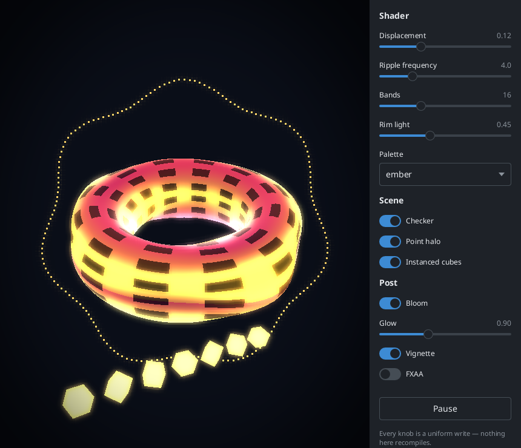

# 3D: the two backends

`<Canvas3D>` and the scene elements inside it draw through one of two OpenGL
pipelines, and which one decides what the scene can contain:

|                | **direct**                                                                                 | **indirect**                                                       |
| -------------- | ------------------------------------------------------------------------------------------ | ------------------------------------------------------------------ |
| how it draws   | OpenGL ES 2 on the GPU; frames reach the server as dma-buf descriptors over DRI3 + Present | GL commands encoded into the X connection                          |
| shaders        | **yes** — `<shaderMaterial>`, GLSL ES 1.00                                                 | none; the protocol encodes no shader objects                       |
| render targets | **yes** — framebuffer objects, so `<effectComposer>` works                                 | none; the protocol encodes no framebuffer objects                  |
| geometry       | vertex buffers on the GPU                                                                  | immediate mode compiled into display lists                         |
| lighting       | per fragment                                                                               | per vertex                                                         |
| cost per frame | one Present request                                                                        | matrices, material state and one `CallList` per mesh               |
| where it runs  | a local connection to a Linux server with DRI3, plus ntk's optional `x11-dri` addon        | any server that allows indirect contexts, including over a network |

**The scene graph is identical.** `<mesh>`, `<group>`, the geometries, the
standard materials, the lights and the `camera` prop mean the same thing on
both, and the same JSX renders on both. Only the renderer differs — that is
the whole reason the split is where it is.

The default is indirect, because it is what react-x11 has always used and
because the two expose different raw GL APIs to `onDraw`. Turn the other on
per app:

```jsx
const root = await createRoot({ glPolicy: 'auto' });
```

`'auto'` uses direct where it is available and indirect otherwise, which is
usually what you want: most modern desktops **refuse** indirect GLX — Xorg
1.17 and later, and Xwayland, ship with it off — and those are exactly the
machines where direct works. `'direct'` and `'off'` are the strict forms, and
`'indirect'` is the default. One run can be switched without touching code:

```sh
NTK_GL_POLICY=direct npm start
```

Everything about how the backend is chosen and why it might be unavailable —
the `GLError` codes, `app.glCapabilities()`, the addon — is ntk's, and is
documented in [ntk's context-gles.md](https://github.com/sidorares/ntk/blob/master/docs/context-gles.md).

## Shader materials


`<shaderMaterial>` runs your GLSL, with three.js's names already declared so
a shader written for r3f — or copied out of a tutorial — compiles unchanged.
The torus above is `examples/shader.jsx`: the vertex shader displaces the
surface along its normals and the fragment shader bands and rim-lights it,
neither of which the fixed-function pipeline can express at all.

```jsx
const vertexShader = `
  varying vec2 vUv;
  void main() {
    vUv = uv;
    gl_Position = projectionMatrix * modelViewMatrix * vec4(position, 1.0);
  }
`;

const fragmentShader = `
  varying vec2 vUv;
  uniform float uTime;
  uniform vec3 uColor;
  void main() {
    float wave = 0.5 + 0.5 * sin(vUv.x * 20.0 + uTime);
    gl_FragColor = vec4(uColor * wave, 1.0);
  }
`;

<Canvas3D camera={{ position: [0, 0, 3] }} frameLoop="always">
  <mesh>
    <planeGeometry args={[2, 2]} />
    <shaderMaterial
      vertexShader={vertexShader}
      fragmentShader={fragmentShader}
      uniforms={{ uTime: { value: t }, uColor: { value: [0.2, 0.6, 1] } }}
    />
  </mesh>
</Canvas3D>;
```

Declared for you, as three.js declares them: attributes `position`, `normal`
and `uv`; uniforms `projectionMatrix`, `modelViewMatrix`, `modelMatrix`,
`viewMatrix`, `normalMatrix` and `cameraPosition`. `<rawShaderMaterial>`
declares nothing at all, also as in three.js.

`uniforms` takes three.js's `{ name: { value } }` shape (a bare value works
too), and the setter follows the JavaScript type:

| value                     | goes out as                                         |
| ------------------------- | --------------------------------------------------- |
| a number                  | `uniform1f`                                         |
| a boolean                 | `uniform1i`                                         |
| 2, 3 or 4 numbers         | `uniform2fv` / `3fv` / `4fv`                        |
| 9 numbers                 | `uniformMatrix3fv`                                  |
| 16 numbers                | `uniformMatrix4fv`                                  |
| `{ width, height, data }` | uploaded as a texture, bound to a unit, `uniform1i` |

A matrix has to be a typed array or a 9/16-long array — nothing else
distinguishes a `mat3` from three `vec3`s.

**Changing a uniform never recompiles anything.** Programs are cached by
shader source, so animating one is a uniform write per frame, which on the
direct backend costs nothing measurable. A shader that will not compile or
link is reported once through `onError` — with the driver's own log, which is
the only thing that says what to fix — and that mesh is skipped rather than
taking the render down.

Asking for `<shaderMaterial>` on a connection with no direct backend throws
when the element is created, naming the actual reason ntk found. That check
happens up front rather than at draw time, because a blank surface is a much
worse way to learn it — but it does mean a scene that would rather degrade
has to ask first:

```jsx
const shaders = useSupports('shaders');
<mesh>
  <boxGeometry args={[1, 1, 1]} />
  {shaders ? (
    <shaderMaterial {...glsl} />
  ) : (
    <meshPhongMaterial color="#e0533d" />
  )}
</mesh>;
```

`<Canvas3D fallback>` does not cover this: it is for a surface with no GL
context at all, and a connection can have perfectly good indirect GL and no
shaders.

### Runtimes

Direct rendering needs a runtime that can send a file descriptor over a unix
socket, because that is how DRI3 hands the server a buffer. `x11` does it
through Node's internal `process.binding('pipe_wrap')`:

| runtime | direct                                                     | indirect |
| ------- | ---------------------------------------------------------- | -------- |
| Node    | yes                                                        | yes      |
| Bun     | **no** — `process.binding('pipe_wrap')` is not implemented | yes      |

Under Bun, `glPolicy: 'auto'` falls back to indirect GLX and
`useSupports('shaders')` is false. `npm run examples:shader` shows what that
looks like.

## What the direct backend does with the standard materials

Same inputs, same look, different pipeline:

| element                    | becomes                               |
| -------------------------- | ------------------------------------- |
| `<meshBasicMaterial>`      | unlit; colour, `opacity`, `map`       |
| `<meshLambertMaterial>`    | per-fragment diffuse                  |
| `<meshPhongMaterial>`      | + Blinn-Phong specular, `shininess`   |
| `<ambientLight>`           | a constant term                       |
| `<directionalLight>`       | a light direction, no attenuation     |
| `<pointLight>`             | a position with distance attenuation  |
| `<spotLight>`              | + cone cutoff and `penumbra`          |
| `transparent` / `opacity`  | alpha blending, with depth writes off |
| `side="double"` / `"back"` | culling off / front-face culling      |
| `map`                      | a texture, uploaded once              |

The program is generated per material configuration **and per light count**,
so a scene with two lights compiles a two-light shader. ES 2 guarantees very
few uniform vectors, and a fixed eight-light shader would not fit the
minimum. The eight-light cap is kept anyway, so a scene lights the same on
both backends.

Two differences you can see, both improvements the GPU makes free:

- **lighting is per fragment.** Fixed-function GL shades per vertex, so a
  large triangle lit from close by bands visibly. This is also what three.js
  does with the same material names.
- **large geometries just work.** Above 65535 vertices the index buffer
  cannot address them, so the geometry is expanded to a flat triangle list
  rather than wrapping — a `<sphereGeometry>` with enough segments really
  does get there.

## Post-processing



`<effectComposer>` renders the scene into a texture and runs it through a
chain of full-screen passes. The picture above is `examples/shader-lab.jsx`
with **Bloom** and **Vignette** on — the glow around the torus is light in
pixels where no geometry was drawn, which is the thing a renderer that only
ever draws to the window cannot produce.

```jsx
<Canvas3D clearColor="#0a0e18">
  <mesh>…</mesh>
  <effectComposer>
    <bloomPass threshold={0.55} strength={0.9} radius={1.4} />
    <vignettePass offset={0.45} darkness={0.65} />
    <fxaaPass />
  </effectComposer>
</Canvas3D>
```

Passes run in tree order, and the order matters: bloom before the vignette,
or the glow is darkened along with everything else; antialiasing last, on the
image that is actually shown.

There is **no `<renderPass>`** as in three.js's composer. The surface's own
scene is always the input — a composer that did not compose this scene would
have nothing to be — so the first pass reads it and the last one writes the
window. `onDraw` output is part of what gets composed, since it draws into
the same target the scene does.

| pass             | props                                                         |
| ---------------- | ------------------------------------------------------------- |
| `<bloomPass>`    | `threshold` (0.75), `strength` (0.8), `radius` (1)            |
| `<vignettePass>` | `offset` (0.5) — where the darkening starts; `darkness` (0.5) |
| `<fxaaPass>`     | none                                                          |
| `<shaderPass>`   | `fragmentShader`, `vertexShader`, `uniforms`                  |

`enabled={false}` on any pass skips it and the rest of the chain still runs;
on the composer it turns the whole thing off and the scene draws straight to
the window. Both are ordinary prop changes, so a checkbox is the whole
implementation of "turn bloom off".

### `<shaderPass>`

Your own GLSL over the whole frame. Declare `uniform sampler2D tDiffuse` for
the incoming image and `varying vec2 vUv` yourself, exactly as a three.js
`ShaderPass` shader does — nothing is injected but the precision line, so a
shader copied from there compiles unchanged:

```jsx
<shaderPass
  fragmentShader={`
    uniform sampler2D tDiffuse;
    uniform float uAmount;
    varying vec2 vUv;
    void main() {
      vec4 c = texture2D(tDiffuse, vUv);
      float grey = dot(c.rgb, vec3(0.299, 0.587, 0.114));
      gl_FragColor = vec4(mix(c.rgb, vec3(grey), uAmount), c.a);
    }
  `}
  uniforms={{ uAmount: { value: 0.6 } }}
/>
```

`uniforms` takes the same shape and the same type mapping as
`<shaderMaterial>`'s. Three more are **set if you declare them**, and
silently dropped if you do not: `resolution` (a `vec2` of pixels),
`texelSize` (`vec2`, 1/pixels — what a pass that samples its neighbours
needs) and `time` (`float`, seconds).

`vertexShader` replaces the built-in full-screen quad shader, which is the
only reason to pass one; it must declare `attribute vec2 position` and write
`vUv`.

### What it costs

Two full-size RGBA targets, allocated at the surface's size and rebuilt on
resize. Only the first has a depth buffer — everything after the scene is a
quad drawn with the depth test off. `<bloomPass>` adds two more at half
resolution and is four draws: a threshold pass, a separable blur across and
down, then a composite that adds the blur back over the original. Blurring
at half size is both cheaper and wider, since the same kernel reaches twice
as far.

The chain ping-pongs between the two targets — read one, write the other —
so no pass ever samples the target it is writing, which is undefined
behaviour in every GL there has ever been.

### When it cannot run

Same rule as `<shaderMaterial>`: asking for `<effectComposer>` on a
connection with no direct backend throws when the element is created, because
GLX has no framebuffer objects to render into. `useSupports('shaders')` is
the check to branch on.

Two failures are handled at draw time instead, because they are only
discoverable once there is a context, and neither takes the scene down:

- a pass whose shader will not compile is reported once through `onError`
  with the driver's log, and **hands the image on unchanged** — the frame is
  still the scene, minus that one effect.
- a render target that comes back incomplete, or a `x11-dri` too old to have
  framebuffer objects at all, is reported once and the scene draws straight
  to the window.

Neither switches `<Canvas3D fallback>` on: the fallback means "this machine
has no 3D", and a typo in a pass shader is not that.

## `useFrame`

The per-surface frame clock. `delta` is seconds since the previous frame, so
motion runs at the same speed whatever the frame rate:

```jsx
function Spin() {
  const [angle, setAngle] = useState(0);
  useFrame((state, delta) => setAngle((a) => a + delta));
  return <mesh rotation={[0, angle, 0]}>…</mesh>;
}
```

`state` carries `{ gl, backend, width, height, elapsed, frame, camera }`.
Subscribing **makes the surface animate**: a `<Canvas3D>` redraws on demand
by default, and a clock nothing drives would tick once and stop. Unmount the
subscriber and it goes quiet again.

This is not r3f's escape from re-rendering. There, `useFrame` mutates an
Object3D in place and React never hears about it; the scene here is described
by props, so a callback that wants to move something sets state and the change
lands on the next frame. What it replaces is a ref to the window and a raw
`requestAnimationFrame`.

## Raw GL through `onDraw`

`onDraw(gl, { width, height })` hands you the context itself, and the two
backends spell GL differently — camelCase ES 2 against PascalCase OpenGL 1.x.
Nothing translates between them. Branch on `gl.backend`:

```jsx
<Canvas3D
  onDraw={(gl) => {
    if (gl.backend === 'direct') gl.clear(gl.COLOR_BUFFER_BIT);
    else gl.Clear(gl.COLOR_BUFFER_BIT);
  }}
/>
```

Code written against one backend will not run on the other, which is why the
default policy does not switch under an app that never asked for it.

## Testing

Both renderers are tested on **what they emit**, not on pixels, because that
is where the property that matters lives — geometry reaches the GPU once and
a frame never re-sends vertices:

- `test/scene3d-shader.test.js` records the GL call stream against a fake
  `gl` and asserts the uploads, the program cache, the generated shader
  sources, the uniform mapping and the draw state. No X server, no GPU, no
  addon — it runs anywhere.
- `test/scene3d.test.js` does the same for indirect, on the encoded GLX bytes.
- `test/postprocess3d.test.js` uses a fake `gl` that tracks binding state
  rather than logging calls, because what matters about a pass chain is the
  state at draw time: which framebuffer a draw lands in, which texture it
  samples, at what size. That is what makes "no pass samples the target it is
  writing" an assertion rather than a hope.

See also [glx.md](glx.md) for the indirect backend's design, and what its
transport can never do.
